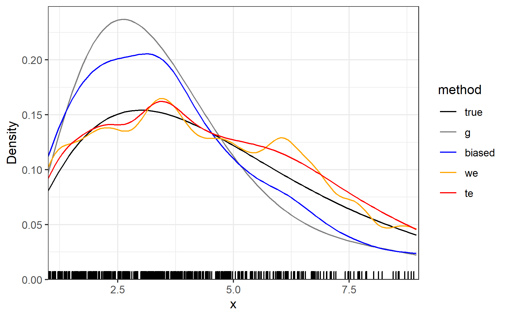

```{r setup, include = FALSE}
library(pracma)
library(GoFKernel)
#devtools::install_github('GwenAntell/kerneval')
library(kerneval)

knitr::opts_chunk$set(
  collapse = TRUE,
  comment = "#>"
)
```

&nbsp;

&nbsp;

&nbsp;

# Contents

1. Overview
    - Why use kernels?
    - How does it work?
    - When should one use **kerneval**?
2. Mathematical framework
3. Transformed density estimation
4. Weighted density estimation
    - Bootstrap bandwidth selection
5. Examples
    - Length bias and inverse length bias
    - Polynomial bias function
6. References

\newpage

# Overview

## Why use kernels?
Kernel density estimation (KDE) is a foundational method in nonparametric statistics. Practical applications abound, from ecology to engineering. There are also theoretical applications of kernels to other statistical methods, such as spline smoothing and machine learning. KDE has achieved its prominence because the basic method is a straightforward, elegant, and effective way to generate a smooth probability distribution function (PDF) from a finite vector of numeric observations. Many R users will be familiar already with kernel-smoothed data visualisations, such as `ggplot2::geom_density()`.

## How does it work?
One can find a brief summary of KDE in nearly any basic statistics textbook (e.g. @Wasserman06). Silverman [-@Silverman86] gives a more thorough introduction to the topic and is written so as to be accessible to readers at a range of experience levels. Many explanations start with histograms, which are a simple variation on KDE wherein the observations are binned. Graphically, the probability function can be visualised by stacking a rectangle in the bin corresponding to each observation. The width of the rectangle along the x-axis is the 'bandwidth' in KDE terminology. The height is scaled such that the probability sums to unity across a given interval. One need not bin the data, however; one could instead place a rectangle directly at the x-value of each observation. The result is a step-wise function (the summed height of all rectangles at any given x-value) that is more jagged than a regular histogram and is called a naive estimator. One step further, one could replace rectangles with Gaussian curves (or triangles, or other kernel distributions). This is implemented in the `density()` function from the base **stats** package. There are more than 100 other packages that also involve KDE. For a comparison of the functionality and performance of 15 major KDE packages, a starting place is Deng and Wickham's [-@Deng11] review.

## When should one use **kerneval**?
Most density estimation methods assume that the probability of observing an event (independent of the probability of the event occurring) is constant across the interval of estimation. However, many empirical datasets violate this assumption. For instance, in some cases the observation rate increases linearly as a function of $x$, so-called length-bias or size-bias.

**kerneval** implements methods to account for observation bias (also called selection bias) when estimating probability densities. One can use length-biased data or data with more complicated bias functions defined for any $x$ in the study interval. The estimation steps will not eliminate bias, but they will reduce it, and the error of the estimate will decrease with sample size--as is the case for most statistical methods for biased data.

# Mathematical framework

The point of KDE is to estimate the probability density function $f(x)$ with $\hat f(x)$. When there is no selection bias (equivalent to a uniform bias function), observations are drawn directly from $F$. However, when there exists selection bias, observations are drawn from $G$:

\begin{equation}
g(x) = \frac{w(x)f(x)}{\mu_w}
\end{equation}

$$\textrm{where } u_w = \int w(u)f(u)du < \infty.$$
Note that this requires $w(u) > 0$ for all $u$. In the case of length-biased data, $w(x) = x$.

Many statisticans attribute the first treatment of the length-bias problem to Cox [-@Cox69], who investigated an example in textile fibre manufacturing. Cristobal and Alcala [-@Cristobal01] trace the ideas to earlier works by Fisher and Rao, however. Vardi [-@Vardi82] proved that Cox's approach was the nonparametric maximum likelihood estimator. Jones [-@Jones91] found a kernel density estimator for this NPMLE, which has been widely adopted and extended. Borrajo and others [-@Borrajo17] developed a bootstrapping bandwidth selection approach for Jones' weighted KDE. Barmi and Simonoff [-@Barmi00] evaluated an alternative approach: transforming the biased data to a scale where classical KDE is applied, then back-transforming and scaling the density. **kerneval** contains tools for both the weighting and transformation approaches to calculate $\hat f(x)$ based on a random sample of $n$ observations drawn from $G$. 

# Transformed density estimation

Barmi and Simonoff [-@Barmi00] proposed an elegant strategy to estimate density functions from selection-biased samples. The premise is that one may transform the empirical sample to an unbiased scale, perform any type of established density estimation, and then back-transform to the original scale to interpret the estimate. This approach has been described as 'adjust-first, smooth-later' because there is no need to modify the density estimation step. For instance, one could perform KDE with a Gaussian kernel and rule-of-thumb bandwidth, so long as KDE is done in the transformed space. The alternative approach involves weighting the kernels (described below) to adjust the estimation during the smoothing step.

Depending on the shape of the true PDF and the bias function, analysts would be wise to inspect kernel density plots on the transformed scale, just as one might plot estimates (on the original scale) when selecting a bandwidth. In particular, one should consider whether the transformed distribution has a long tail or otherwise is difficult to estimate. If the density estimation problem seems more straightforward on the original scale, one could weight the KDE instead of transforming the data. Example 1 below illustrates these trade-offs.

Continuing with the mathematical notation of Eq. 1, let $X_1, X_2, ..., X_n$ be a random sample of $n$ observations from $G$. To transform these empirical data, calculate the cumulative distribution function of the bias function, $W(x) = \int_0^x w(u)du$. Define $Y_i = W(X_i)$ for $i = 1, 2, ..., n$. To estimate the true probability distribution function $f$, 

1. Perform density estimation on the sample $Y_1, Y_2, ..., Y_n$
2. Scale by $\hat{\mu}$ so the function integrates to unity
3. Back-transform from $y$ to $x$, using $W^{-1}(y)$

The `transdens()` function evaluates these steps, calling the `inverse()` function from **GoFKernel** [@Pavia15] to estimate the inverse cumulative distribution function.

# Weighted density estimation

The weighting operation of Jones [-@Jones91] is the KDE method for selection-biased data that has received the most attention in the statistics literature. The method is a slight modification of classical KDE and does not add onerous calculation, so it is an attractive approach. However, the choice of bandwidth is complicated and potentially time-consuming (e.g. bootstrap selection, described below). 

To account for selection bias, the kernel on each datum is weighted by the inverse of the observation probability at that point. An informal, geometric way to visualise this is to imagine a one-dimensional axis with several Gaussian kernels along it, one at each datum. In regions of the axis with higher intensity of observation, pinch off some of the tops of the kernels. Then, add this area to the tops of the kernels in regions where observation is less probable. In a formal mathematical framework, weighting can be expressed by adding a scaling factor to the estimated density function. The classical definition of the KDE is:
$$\hat f (x) = \frac{1}{nh} \sum_i^n K\bigg( \frac{x-x_i}{h} \bigg)$$
The weighted estimate is:
$$\hat f (x) = \frac{1}{n} \hat u \sum_i^n \frac{1}{w(x_i)} K\bigg( \frac{x-x_i}{h} \bigg)$$
$$\textrm{where } \hat u = \bigg[ \frac 1 n \sum_i \frac{1}{w(x_i)} \bigg] ^{-1}.$$

Weighted kernel estimation should not be confused with adaptive kenel estimation, which is most relevant when the dataset is large and the probability function is rougher in some areas than others. (The interested reader would do well to consult  Wasserman [-@Wasserman06] 9.10, 'Do adaptive methods work'?) Both approaches modify the individual kernels that contribute to an estimate. However, in adaptive KDE the badwidth of each kernel is adjusted, whereas in weighted KDE the bandwidth is constant while the height (total probability density) of each kernel is adjusted.

## Bootstrap bandwidth selection

The theory behind bandwidth selection can be summarised as a series of 3, potentially iterative steps. Luckily, in practice, there is a computational shortcut to find the bandwidth $h^*$ that minimises bootstrapped mean integrated squared error (BMISE). 

1. Pick an initial ('pilot') bandwidth $\lambda$ and kernel $L$. Smooth the empirical distribution $F_n$ with these parameters to get $\hat f_\lambda$. Bose and Dutta [-@Bose13] recommended the use of a Gaussian kernel with $\lambda = \frac{1}{8}n^{-1/9}$.
2. Resample $n$ observation from $\hat f_\lambda$, for $B$ replicates. This is equivalent to resampled with replacement from $F_n$, then adding $\epsilon$ to each resampled set of observations, $X^*$. The $\epsilon$ are i.i.d. from $\frac {K(\cdot/\lambda)}{\lambda}$. (This step is not run in practice.)
3. Calculate the MISE of the bootstrap samples. 
$BMISE(h, \lambda) = \frac 1 B \sum_{i=1}^{B} \int [f^*_{h,i}(x) - \hat f_{\lambda}(x)]^2 dx = V^*(h)+B^{*2}(h).$

The variance and bias terms of BMISE can be expressed in terms of $K_h$ and $K_{\lambda}$ convolution, which do not depend on $X^*$. Therefore, it is possible to find the $h^*$ that minimises BMISE without actually drawing bootstrap samples. One must still pick a pilot bandwidth, however.

The internal `selectbw()` function selects the bandwidth following the bootstrap method of Borrajo and others [-@Borrajo17].

# Examples

This vignette gives examples that compare the performance of weighting vs. transformation approaches, and examine the effect of sample size. The data in the first example are length-biased, while the data in the second example are generated according to a custom (fourth-order polynomial) bias function.

## 1. Length bias and inverse length bias

The first example replications the simulation study of Barmi and Simonoff [-@Barmi00]. We will draw biased samples from known distributions and then estimate PDFs with transformed vs. weighted kernels. The simulations make use of the convenient result that when sampling is length biased, $w(x) = x$, samples drawn from a true distribution of $\chi^2_k$ (chi-square distribution with $k$ degrees of freedom) will come from an observed distribution ($G$) of $\chi^2_{k+2}$. If there is inverse length bias, $w(x) = 1/x$, then $G$ is $\chi^2_{k-2}$.

There are eight simulation scenarios in total. The first four scenarios contain length-bias, and the true PDF $F$ is set as a chi-square distribution with either 2 or 12 degrees of freedom. (Thus, $G$ is a chi-square distribution with 4 or 14 degrees of freedom, respectively.) For each PDF, sample size is set at either 50 or 200 observations. 
```{r}
nVals <- c(50, 200)
kValsLin <- c(2, 12)
wLin <- function(x){ x }
degLin <- function(k){ k + 2 }
```

The remaining four scenarios contain inverse-length-bias, and $F$ is a chi-square distribution with either 3 or 16 degrees of freedom. (Thus, $G$ is a chi-square distribution with 1 or 14 degrees of freedom, respectively.) As before, $n = 50$ or 200.
```{r}
kValsInv <- c(3, 16)
wInv <- function(x){ 1/x }
degInv <- function(k){ k - 2 }
```

The original study replicated each scenario with 500 samples. Depending on processing speed, and without parallelising calculations, the full simulation and estimation could run for an hour or more. For a quick exploration of the example, one could run fewer iterations.
```{r}
nreps <- 25 # 500
```

To compare the performance of weighted vs. transformed KDE in each scenario, the standard approach is to calculate the mean integrated squared error, MISE. First, draw a sample of $n$ observations from a chi-square distribution with given degrees of freedom. Then, calculate $\hat f$ with each KDE method. Finally, integrate the squared difference between the estimated and true PDF over the study integral. The ultimate goal is to calculate the expectation of this integrated error, however, so it is helpful to wrap all of these steps into a function that can be iterated. The mean ISE will converge on the MISE with more replicates.
```{r}
miser1 <- function(w, n, k, deg){
  df <- deg(k)
  x <- rchisq(n = n, df = df)
  
  # weighted KDE
  wtEst <- wdens(x, w)
  wtFun <- approxfun(wtEst$x, wtEst$y)
  wtSE <- function(x) (wtFun(x) - dchisq(x, df=k))^2
  wtISE <- integral(wtSE, min(wtEst$x), max(wtEst$x))
  
  # transformed KDE
  transEst <- transdens(x, w)
  transFun <- approxfun(transEst$x, transEst$y)
  transSE <- function(x) (transFun(x) - dchisq(x, df=k))^2
  transISE <- integral(transSE, min(transEst$x), max(transEst$x))
  
  c(wtISE, transISE)
}
```

There are many ways one could iterate through each sample and simulated distribution. Here are nested for-loops to produce the results in the same format as the MISE values from Table 1 of @Barmi00.
```{r, message = FALSE, warning = FALSE}
# tbl1a <- tbl1b <- data.frame()
# for (n in nVals){
#  for (k in kValsLin){
#    mises <- replicate(n = nreps,
#                       miser1(w = wLin, n = n, k = k, deg = degLin)
#                       )
#    miseAvg <- rowMeans(mises)
#    iter <- data.frame(k, n, t(miseAvg))
#    tbl1a <- rbind(tbl1a, iter)
#  }
#  for (k in kValsInv){
#    mises <- replicate(n = nreps,
#                       miser1(w = wInv, n = n, k = k, deg = degInv)
#                       )
#    miseAvg <- rowMeans(mises)
#    iter <- data.frame(k, n, t(miseAvg))
#    tbl1b <- rbind(tbl1b, iter)
#  }
# }
```

The average ISE values from 500 replicates (i.e.  estimates of MISE) are listed in Table 1, and agree with the original trends reported by Barmi and Simonoff [-@Barmi00], reproduced in Table 2. Namely, KDE is more accurate when applied to more symmetric distributions (chi-square distributions with 12 or 16 degrees of freedom instead of 2 or 3). In addition, the transformation approach performs better for inverse-length-biased data than for length-biased data, because the transformed axis in the former case (a log-x scale) is a 'generally favourable' estimation problem.

```{r, echo = FALSE}
opts <- options(knitr.kable.NA = '')

# ordr <- order(tbl1a$k)
# tbl1a <- tbl1a[ordr,]
# tbl1b <- tbl1b[ordr,]
# curTbl <- rbind(
#   c('w(x)=x ',NA,NA,NA), tbl1a,
#   c('w(x)=1/x',NA,NA,NA), tbl1b
# )
# colnames(curTbl) <- c('k', 'n', 'Weighted', 'Transformed')
# write.csv(curTbl, 'vignettes/replicated-table-1.csv', row.names = FALSE)
curTbl <- read.csv('replicated-table-1.csv')
knitr::kable(curTbl, digits = 4, align = 'rrrr',
             caption = 'Replication of published results')

# plot the original (published) table
tbl <- read.csv('Barmi-Simonoff-2000_table-1.csv')
# number of digits is variable so convert to text and R-align
tbl$Weighted <- as.character(tbl$Weighted)
tbl$Transformed <- as.character(tbl$Transformed)

knitr::kable(tbl, align = 'rrll',
             caption = 'Barmi and Simonoff (2000) table 1')

# restore global R options
options(opts)
```

Although the patterns in Tables 1 and 2 match, the exact values of respective entries differ. At the second and third significant digits, some variation seems to occur due to stochasticity in the replicates. Perhaps 1000 replicates would be more suitable to approximate the MISE. The larger descrepancies might be due to differences in bandwidth selection method. The authors chose the bandwidth 'in each replication to minimise ISE,' but this leaves some ambiguity. In the code above, the default methods of bandwidth selection are applied: the 'nrd0' rule-of-thumb for the transformation approach, and the bootstrap estimate with the rule-of-thumb as pilot for the weighted approach.

## 2. Polynomial bias function

Length bias is the type of selection bias that appears most frequently in the statistical literature. However, there are many situations where observation probability could behave in a more complicated way, perhaps non-monotonically. The **kerneval** user may work with any bias function that is positive and continuously defined over the study interval. 

The present example is based loosely on an empirical dataset of marine species' ecological niches. The $x$-axis represents a resource or environmental gradient (e.g. temperature), and the PDF is the probability of a species' occurrence for a given resource density/environmental state. Species tend to achieve peak abundance at an optimum condition, and to become rarer in habitats farther from the optimum. The true PDF $F$ in this example is a chi-square distribution with 5 degrees of freedom, representing a species with a broad tolerance. 

Unfortunately for ecologists, it is impossible to measure $F$ directly. Instead, one might have the spatial coordinates where a focal species has been observed, along with the environmental conditions at those locations. KDE on these data will provide an estimate $\hat f$ of the species' niche along the given habitat axes. Unless the project managers took great care with the original sampling design, however, the data will be biased by the relative availability of habitat, the way field researchers took observations, or other spatio-temporal effects. (For instance, GPS trackers tend to lose satellite connection when an animal wanders into dense vegetation, leading to a larger observation probability in open terrain (@Frair10).) The bias function in this example is a 4th-order polynomial, defined over the interval [0,10]. This function reflects (1) the larger surface area of temperate zones relative to the equatorial or polar zones, (2) asymmetries between the Northern and Southern hemisphere, and (3) the most common routes of research vessels.
```{r}
w <- function(x){
  x <- 0.3*(x - 5.5)
  -0.8 * x^4 + 0.7 * x^3 + 1.5 * x^2 - 2 * x + 2
}
g <- function(x){
  g1 <- function(x) w(x) * dchisq(x, df=5)
  u <- integral(g1, 0, 10)
  w(x) * dchisq(x, df=5) / u
}
```

As in Example 1 above, the MISE is a useful way to compare the performance of different KDE methods. The weighted and transformed approaches both reduce the estimation error compared to the base **stats** method, which does not consider selection bias. This result is unsurprising; it is more interesting to examine the magnitude of the improvement, and how the performance depends on sample size.
```{r}
miser2 <- function(g, n){
  x <- random.function(n = n, g, lower=0, upper=10)
  
  # weighted KDE
  wtEst <- wdens(x, w)
  wtFun <- approxfun(wtEst$x, wtEst$y)
  wtSE <- function(x) (wtFun(x) - dchisq(x, df=5))^2
  wtISE <- integral(wtSE, min(wtEst$x), max(wtEst$x))
  
  # transformed KDE
  transEst <- transdens(x, w)
  transFun <- approxfun(transEst$x, transEst$y)
  transSE <- function(x) (transFun(x) - dchisq(x, df=5))^2
  transISE <- integral(transSE, min(transEst$x), max(transEst$x))
  
  # KDE without accounting for selection bias
  baseEst <- density(x, cut=0)
  baseFun <- approxfun(baseEst$x, baseEst$y)
  baseSE <- function(x) (baseFun(x) - dchisq(x, df=5))^2
  baseISE <- integral(baseSE, min(baseEst$x), max(baseEst$x))
  
  c(wtISE, transISE, baseISE)
}

# iseSmolN <- replicate(10, miser2(g = g, n = 50))
# round( rowMeans(iseSmolN), 4)

# weighted, transformed, biased
#> [1] 0.0100 0.0045 0.0144
```

If one repeats this exercise with $n=500$, both the weighted and transformed estimates improve several times over, but the uncorrected estimate does not.
```{r}
# iseBigN <- replicate(10, miser2(g = g, n = 500))
# round( rowMeans(iseBigN), 4)

# weighted, transformed, biased
#> [1] 0.0029 0.0018 0.0127
```

Although MISE is a useful metric, as a single number it cannot indicate the manner in which the estimate errs along the study interval. A graphical approach provides this complementary information, as demonstrated in Figures 1 and 2. The weighted (in orange) and transformed (in red) kernel estimates approach the true density as sample size increases from 50 to 500 observations. The weighted estimate undersmoothes at both sample sizes, however. The uncorrected estimate (in blue) follows the selection-biased PDF (in grey) regardless of sample size.
```{r, echo = FALSE}
# library(ggplot2)
# 
# for (n in c(50, 500)){
#   
#   set.seed(20)
#   x <- random.function(n = n, g, lower=0, upper=10)
#   
#   # weighted KDE
#   wtEst <- wdens(x, w)
#   wtFun <- approxfun(wtEst$x, wtEst$y)
#   
#   # transformed KDE
#   transEst <- transdens(x, w)
#   transFun <- approxfun(transEst$x, transEst$y)
#   
#   # KDE without accounting for selection bias
#   baseEst <- density(x, cut=0)
#   baseFun <- approxfun(baseEst$x, baseEst$y)
#   
#   u <- seq(1,9,by=.075)
#   kdeEsts <- data.frame(x=u)
#   kdeEsts$true <- dchisq(u, df=5)
#   kdeEsts$g <- g(u)
#   kdeEsts$biased <- baseFun(u)
#   kdeEsts$we <- wtFun(u)
#   kdeEsts$te <- transFun(u)
#   
#   estsLong <- tidyr::pivot_longer(kdeEsts,
#                                   cols=c('true','g','biased','we','te'),
#                                   names_to='method')
#   estsLong$method <- factor(estsLong$method, levels=c('true','g','biased','we','te'))
#   numNa <- nrow(estsLong) - length(x)
#   estsLong$rugHack <- c(x, rep(NA, numNa))
#   ymx <- max(estsLong$value, na.rm=TRUE) * 1.05
#   colr <- c('black','grey50','blue','orange','red')
#   names(colr) <- c('true','g','biased','we','te')
#   
#   polyBiasP <-
#     ggplot2::ggplot(data=estsLong, aes(x=x)) +
#     theme_bw() +
#     scale_y_continuous(name='Density', limits=c(0,ymx), expand=c(0,0)) +
#     scale_x_continuous(limits=c(1,9), expand=c(0,0)) +
#     geom_line(aes(y=value, colour=method)) +
#     geom_rug(aes(x=rugHack), sides='b') +
#     scale_colour_manual(values=colr)
#   
#   polyBiasP
#   
#  polyNm <- paste0('KDE_example_chisq5_',n,'obs.png')
#  png(polyNm, width=6, height=3.75, units = 'in', res = 300)
#  print(polyBiasP)
#  dev.off()
# }
```




\newpage

# References
